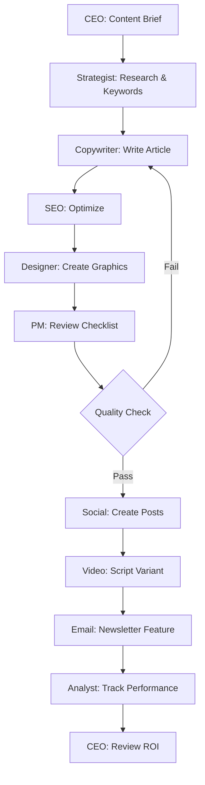

# JMG Content Group: 24/7 AI Team Architectuur

Een volledig functioneel content productie team bestaande uit gespecialiseerde AI-agents die 24/7 draaien op een Hetzner VPS. Elk teamlid heeft een eigen workspace, skills en verantwoordelijkheden.

## Team Structuur

### 1. **CEO / Orchestrator** (MiniMax abab6.5-chat)
**Rol:** Strategische planning, taak-distributie, quality control, team coördinatie

**Verantwoordelijkheden:**
- Content strategie planning
- Werk delegeren naar specialisten
- Quality control van deliverables
- Client communicatie (via WhatsApp/Telegram)
- Team performance monitoring

**Workspace:** `~/.clawdbot/agents/ceo`

**Tools:**
- Toegang tot alle team workspaces
- Analytics dashboard
- Client communication channels
- Task distribution system

**Cron Jobs:**
```bash
# Dagelijkse strategie review
0 6 * * * "Review content performance en plan vandaag"

# Wekelijkse planning
0 9 * * 1 "Wekelijkse content planning en OKR review"

# Team standup
0 9,14,18 * * * "Check team progress en blockers"
```

---

### 2. **Content Strategist** (MiniMax abab6.5-chat)
**Rol:** Content planning, keyword research, trend analysis

**Verantwoordelijkheden:**
- SEO keyword research
- Content calendar planning
- Competitor analysis
- Trend monitoring (Google Trends, social media)
- Content briefs schrijven

**Workspace:** `~/.clawdbot/agents/strategist`

**Skills:**
```javascript
// ~/.clawdbot/agents/strategist/skills/keyword-research.mjs
export const meta = {
  name: 'keyword-research',
  description: 'SEO keyword research via Ahrefs/SEMrush API'
}

// ~/.clawdbot/agents/strategist/skills/trend-monitor.mjs
export const meta = {
  name: 'trend-monitor',
  description: 'Monitor Google Trends en social media trends'
}

// ~/.clawdbot/agents/strategist/skills/competitor-analysis.mjs
export const meta = {
  name: 'competitor-analysis',
  description: 'Analyseer concurrent content en performance'
}
```

**Cron Jobs:**
```bash
# Dagelijkse trend monitoring
0 8 * * * "Check trending topics in onze niche"

# Wekelijkse keyword research
0 10 * * 1 "Update keyword opportuniteiten lijst"

# Maandelijkse competitor audit
0 9 1 * * "Volledige concurrent content audit"
```

---

### 3. **Senior Copywriter** (z.ai GLM-4-Flash)
**Rol:** Long-form content creatie, blog posts, whitepapers

**Verantwoordelijkheden:**
- Blog artikelen schrijven (2000+ woorden)
- Whitepapers en e-books
- Case studies
- Brand storytelling
- SEO-geoptimaliseerde content

**Workspace:** `~/.clawdbot/agents/copywriter`

**Skills:**
```javascript
// ~/.clawdbot/agents/copywriter/skills/blog-writer.mjs
export const meta = {
  name: 'blog-writer',
  description: 'Schrijf SEO-geoptimaliseerde blog posts'
}

// ~/.clawdbot/agents/copywriter/skills/tone-analyzer.mjs
export const meta = {
  name: 'tone-analyzer',
  description: 'Analyseer en match brand voice/tone'
}
```

**Cron Jobs:**
```bash
# Dagelijkse content productie
0 9 * * 1-5 "Schrijf 1 blog artikel volgens content calendar"

# Wekelijkse content review
0 16 * * 5 "Review en optimize deze week's content"
```

---

### 4. **Social Media Manager** (MiniMax abab6.5-chat)
**Rol:** Social media content, community management, engagement

**Verantwoordelijkheden:**
- Social media posts (Twitter/X, LinkedIn, Instagram)
- Hashtag research
- Community engagement
- Social listening
- Content repurposing

**Workspace:** `~/.clawdbot/agents/social`

**Skills:**
```javascript
// ~/.clawdbot/agents/social/skills/post-generator.mjs
export const meta = {
  name: 'post-generator',
  description: 'Genereer platform-specifieke social posts'
}

// ~/.clawdbot/agents/social/skills/hashtag-research.mjs
export const meta = {
  name: 'hashtag-research',
  description: 'Find trending en relevante hashtags'
}

// ~/.clawdbot/agents/social/skills/engagement-tracker.mjs
export const meta = {
  name: 'engagement-tracker',
  description: 'Track en analyseer social engagement'
}
```

**Cron Jobs:**
```bash
# Posts elke 3 uur (werkuren)
0 9,12,15,18 * * * "Post scheduled social content"

# Dagelijkse engagement monitoring
0 10,14,17 * * * "Check mentions en antwoord op comments"

# Wekelijkse performance review
0 9 * * 1 "Analyseer vorige week social performance"
```

---

### 5. **SEO Specialist** (MiniMax abab6.5-chat)
**Rol:** Technical SEO, on-page optimization, link building

**Verantwoordelijkheden:**
- Technical SEO audits
- Meta tags optimization
- Internal linking strategy
- Backlink analysis
- Schema markup implementation

**Workspace:** `~/.clawdbot/agents/seo`

**Skills:**
```javascript
// ~/.clawdbot/agents/seo/skills/seo-audit.mjs
export const meta = {
  name: 'seo-audit',
  description: 'Technical SEO audit via Screaming Frog API'
}

// ~/.clawdbot/agents/seo/skills/backlink-monitor.mjs
export const meta = {
  name: 'backlink-monitor',
  description: 'Monitor backlink profile via Ahrefs'
}

// ~/.clawdbot/agents/seo/skills/meta-optimizer.mjs
export const meta = {
  name: 'meta-optimizer',
  description: 'Optimize meta titles en descriptions'
}
```

**Cron Jobs:**
```bash
# Dagelijkse ranking check
0 8 * * * "Check keyword rankings en wijzigingen"

# Wekelijkse technical audit
0 10 * * 1 "Run technical SEO audit"

# Maandelijkse backlink audit
0 9 1 * * "Volledige backlink profile analyse"
```

---

### 6. **Video Content Creator** (z.ai GLM-4-Flash)
**Rol:** Video scripts, YouTube optimization, video content strategy

**Verantwoordelijkheden:**
- YouTube video scripts
- Video SEO (titles, descriptions, tags)
- Thumbnail concepts
- Video content calendar
- Transcriptie en repurposing

**Workspace:** `~/.clawdbot/agents/video`

**Skills:**
```javascript
// ~/.clawdbot/agents/video/skills/script-writer.mjs
export const meta = {
  name: 'script-writer',
  description: 'Schrijf engaging video scripts'
}

// ~/.clawdbot/agents/video/skills/youtube-seo.mjs
export const meta = {
  name: 'youtube-seo',
  description: 'Optimize video voor YouTube search'
}

// ~/.clawdbot/agents/video/skills/transcript-repurpose.mjs
export const meta = {
  name: 'transcript-repurpose',
  description: 'Hergebruik video transcripts voor blogs/social'
}
```

**Cron Jobs:**
```bash
# Wekelijkse video script
0 10 * * 2 "Schrijf 1 video script volgens planning"

# Dagelijkse YouTube monitoring
0 9,17 * * * "Check video performance en comments"
```

---

### 7. **Email Marketing Specialist** (MiniMax abab6.5-chat)
**Rol:** Email campaigns, newsletters, automation flows

**Verantwoordelijkheden:**
- Newsletter content
- Email sequences
- Subject line testing
- Segmentation strategy
- A/B testing

**Workspace:** `~/.clawdbot/agents/email`

**Skills:**
```javascript
// ~/.clawdbot/agents/email/skills/newsletter-writer.mjs
export const meta = {
  name: 'newsletter-writer',
  description: 'Schrijf engaging newsletter content'
}

// ~/.clawdbot/agents/email/skills/subject-line-generator.mjs
export const meta = {
  name: 'subject-line-generator',
  description: 'Genereer hoog-converterende subject lines'
}

// ~/.clawdbot/agents/email/skills/sequence-builder.mjs
export const meta = {
  name: 'sequence-builder',
  description: 'Bouw email automation sequences'
}
```

**Cron Jobs:**
```bash
# Wekelijkse newsletter
0 9 * * 3 "Schrijf en schedule wekelijkse newsletter"

# Dagelijkse performance check
0 10 * * * "Analyseer email campaign performance"
```

---

### 8. **Data Analyst** (MiniMax abab6.5-chat)
**Rol:** Analytics, reporting, performance tracking

**Verantwoordelijkheden:**
- Google Analytics rapportage
- Content performance analysis
- ROI tracking
- Trend identification
- Dashboard building

**Workspace:** `~/.clawdbot/agents/analyst`

**Skills:**
```javascript
// ~/.clawdbot/agents/analyst/skills/ga-reporter.mjs
export const meta = {
  name: 'ga-reporter',
  description: 'Generate Google Analytics reports'
}

// ~/.clawdbot/agents/analyst/skills/content-performance.mjs
export const meta = {
  name: 'content-performance',
  description: 'Analyseer content performance metrics'
}

// ~/.clawdbot/agents/analyst/skills/roi-calculator.mjs
export const meta = {
  name: 'roi-calculator',
  description: 'Bereken content marketing ROI'
}
```

**Cron Jobs:**
```bash
# Dagelijkse quick stats
0 8 * * * "Daily performance snapshot naar team Slack"

# Wekelijkse diepgaande analyse
0 9 * * 1 "Wekelijks performance report"

# Maandelijks executive report
0 10 1 * * "Maandelijks executive dashboard update"
```

---

### 9. **Graphic Designer** (z.ai GLM-4v + DALL-E/Midjourney)
**Rol:** Visual content, graphics, infographics

**Verantwoordelijkheden:**
- Social media graphics
- Blog featured images
- Infographics
- Brand assets
- Thumbnail designs

**Workspace:** `~/.clawdbot/agents/designer`

**Skills:**
```javascript
// ~/.clawdbot/agents/designer/skills/image-generator.mjs
export const meta = {
  name: 'image-generator',
  description: 'Generate images via DALL-E/Midjourney API'
}

// ~/.clawdbot/agents/designer/skills/canva-automation.mjs
export const meta = {
  name: 'canva-automation',
  description: 'Automate Canva designs via API'
}

// ~/.clawdbot/agents/designer/skills/brand-checker.mjs
export const meta = {
  name: 'brand-checker',
  description: 'Check designs tegen brand guidelines'
}
```

**Cron Jobs:**
```bash
# Dagelijkse social graphics
0 8 * * * "Genereer social media graphics voor vandaag"

# Wekelijkse blog images
0 10 * * 1 "Maak featured images voor deze week's blogs"
```

---

### 10. **Project Manager / Scrum Master** (MiniMax abab6.5-chat)
**Rol:** Workflow management, deadline tracking, team coordination

**Verantwoordelijkheden:**
- Sprint planning
- Deadline monitoring
- Blocker resolution
- Team standups
- Resource allocation

**Workspace:** `~/.clawdbot/agents/pm`

**Skills:**
```javascript
// ~/.clawdbot/agents/pm/skills/task-tracker.mjs
export const meta = {
  name: 'task-tracker',
  description: 'Track tasks via Linear/Jira/Asana API'
}

// ~/.clawdbot/agents/pm/skills/deadline-monitor.mjs
export const meta = {
  name: 'deadline-monitor',
  description: 'Monitor deadlines en stuur herinneringen'
}

// ~/.clawdbot/agents/pm/skills/standup-generator.mjs
export const meta = {
  name: 'standup-generator',
  description: 'Generate standup reports van alle agents'
}
```

**Cron Jobs:**
```bash
# Dagelijkse standup
0 9 * * 1-5 "Verzamel standup updates van alle agents"

# Wekelijkse sprint planning
0 10 * * 1 "Sprint planning en retrospective"

# Dagelijkse deadline check
0 17 * * * "Check approaching deadlines en stuur alerts"
```

---

## Technische Architectuur

### Hetzner VPS Setup

**Aanbevolen Specificaties:**
```
CPU: 8 cores (AMD EPYC)
RAM: 32GB
Storage: 240GB SSD
OS: Ubuntu 22.04 LTS
Location: Falkenstein, Germany (EU data privacy)
```

**Kosten:** ~€40-60/maand voor dedicated resources

### Directory Structuur

```
/home/clawdbot/
├── .clawdbot/
│   ├── agents/
│   │   ├── ceo/
│   │   │   ├── workspace/
│   │   │   ├── sessions/
│   │   │   ├── skills/
│   │   │   ├── AGENTS.md
│   │   │   ├── SOUL.md
│   │   │   └── TOOLS.md
│   │   ├── strategist/
│   │   ├── copywriter/
│   │   ├── social/
│   │   ├── seo/
│   │   ├── video/
│   │   ├── email/
│   │   ├── analyst/
│   │   ├── designer/
│   │   └── pm/
│   ├── skills/ (shared)
│   ├── credentials/
│   └── clawdbot.json
├── content-production/
│   ├── drafts/
│   ├── published/
│   ├── assets/
│   └── calendar/
└── scripts/
    ├── backup.sh
    └── monitoring.sh
```

### Clawdbot Configuratie

```json5
// ~/.clawdbot/clawdbot.json
{
  gateway: {
    mode: "local",
    bind: "127.0.0.1",
    port: 18789,
    auth: {
      enabled: true,
      token: process.env.CLAWDBOT_GATEWAY_TOKEN
    }
  },

  models: {
    providers: {
      "z.ai": {
        apiKey: process.env.ZAI_API_KEY,
        baseURL: "https://api.z.ai/v1"
      },
      "minimax": {
        apiKey: process.env.MINIMAX_API_KEY,
        baseURL: "https://api.minimax.chat/v1",
        groupId: process.env.MINIMAX_GROUP_ID
      }
    }
  },

  agents: {
    defaults: {
      model: "minimax/abab6.5-chat",
      workspace: "/home/clawdbot/.clawdbot/agents/ceo/workspace",
      blockStreaming: true,
      queue: {
        mode: "followup",
        debounceMs: 2000
      }
    },

    routing: {
      // CEO - Orchestrator (z.ai GLM-4-Flash)
      ceo: {
        model: "z.ai/glm-4-flash",
        workspace: "/home/clawdbot/.clawdbot/agents/ceo/workspace",
        channels: ["telegram:CEO", "slack:#ceo-commands"],
        systemPrompt: "Je bent de CEO van JMG Content Group..."
      },

      // Content Strategist (MiniMax abab6.5-chat)
      strategist: {
        model: "minimax/abab6.5-chat",
        workspace: "/home/clawdbot/.clawdbot/agents/strategist/workspace",
        channels: ["slack:#strategy"],
        systemPrompt: "Je bent de Content Strategist..."
      },

      // Senior Copywriter (z.ai GLM-4-Flash - hoogste kwaliteit)
      copywriter: {
        model: "z.ai/glm-4-flash",
        workspace: "/home/clawdbot/.clawdbot/agents/copywriter/workspace",
        channels: ["slack:#content-production"],
        systemPrompt: "Je bent de Senior Copywriter..."
      },

      // Social Media Manager (MiniMax abab6.5-chat)
      social: {
        model: "minimax/abab6.5-chat",
        workspace: "/home/clawdbot/.clawdbot/agents/social/workspace",
        channels: ["slack:#social-media"],
        systemPrompt: "Je bent de Social Media Manager..."
      },

      // SEO Specialist (MiniMax abab6.5-chat)
      seo: {
        model: "minimax/abab6.5-chat",
        workspace: "/home/clawdbot/.clawdbot/agents/seo/workspace",
        channels: ["slack:#seo"],
        systemPrompt: "Je bent de SEO Specialist..."
      },

      // Video Content Creator (z.ai GLM-4-Flash)
      video: {
        model: "z.ai/glm-4-flash",
        workspace: "/home/clawdbot/.clawdbot/agents/video/workspace",
        channels: ["slack:#video-production"],
        systemPrompt: "Je bent de Video Content Creator..."
      },

      // Email Marketing Specialist (MiniMax abab6.5-chat)
      email: {
        model: "minimax/abab6.5-chat",
        workspace: "/home/clawdbot/.clawdbot/agents/email/workspace",
        channels: ["slack:#email-marketing"],
        systemPrompt: "Je bent de Email Marketing Specialist..."
      },

      // Data Analyst (MiniMax abab6.5-chat)
      analyst: {
        model: "minimax/abab6.5-chat",
        workspace: "/home/clawdbot/.clawdbot/agents/analyst/workspace",
        channels: ["slack:#analytics"],
        systemPrompt: "Je bent de Data Analyst..."
      },

      // Graphic Designer (z.ai GLM-4.6v - vision model voor visuele analyse)
      designer: {
        model: "z.ai/glm-4v",  // Vision model voor image analysis
        workspace: "/home/clawdbot/.clawdbot/agents/designer/workspace",
        channels: ["slack:#design"],
        systemPrompt: "Je bent de Graphic Designer met vision capabilities voor brand consistency checks..."
      },

      // Project Manager (MiniMax abab6.5-chat)
      pm: {
        model: "minimax/abab6.5-chat",
        workspace: "/home/clawdbot/.clawdbot/agents/pm/workspace",
        channels: ["slack:#project-management"],
        systemPrompt: "Je bent de Project Manager..."
      }
    }
  },

  channels: {
    // Slack voor team communicatie
    slack: {
      enabled: true,
      token: process.env.SLACK_BOT_TOKEN,
      dm: {
        policy: "allowlist",
        allowFrom: ["U12345CEO"] // Jouw Slack user ID
      },
      groups: {
        enabled: true,
        mentionGating: true
      }
    },

    // Telegram voor client communicatie
    telegram: {
      enabled: true,
      token: process.env.TELEGRAM_BOT_TOKEN,
      dm: {
        policy: "pairing" // Secure client access
      }
    },

    // Discord voor publieke community (optioneel)
    discord: {
      enabled: true,
      token: process.env.DISCORD_BOT_TOKEN,
      dm: {
        policy: "pairing"
      }
    }
  },

  tools: {
    exec: {
      enabled: true,
      policy: "approval", // Veiligheid first
      applyPatch: true
    },
    browser: {
      enabled: true,
      headless: true
    }
  },

  webhooks: {
    // Google Analytics webhook
    analytics: {
      url: "https://your-analytics-webhook.com/api",
      events: ["agent.completed"],
      headers: {
        "Authorization": "Bearer ${GA_WEBHOOK_TOKEN}"
      }
    },

    // CRM integration
    crm: {
      url: "https://your-crm.com/api/webhook",
      events: ["message.received", "agent.completed"]
    }
  }
}
```

### Docker Compose Setup (Optioneel)

```yaml
# docker-compose.yml
version: '3.8'

services:
  clawdbot-gateway:
    image: node:22-alpine
    container_name: jmg-content-gateway
    restart: unless-stopped
    working_dir: /app
    volumes:
      - /home/clawdbot/.clawdbot:/root/.clawdbot
      - /home/clawdbot/content-production:/app/content-production
    environment:
      - NODE_ENV=production
      - CLAWDBOT_GATEWAY_TOKEN=${CLAWDBOT_GATEWAY_TOKEN}
      - SLACK_BOT_TOKEN=${SLACK_BOT_TOKEN}
      - TELEGRAM_BOT_TOKEN=${TELEGRAM_BOT_TOKEN}
      - DISCORD_BOT_TOKEN=${DISCORD_BOT_TOKEN}
      - ZAI_API_KEY=${ZAI_API_KEY}
      - MINIMAX_API_KEY=${MINIMAX_API_KEY}
      - MINIMAX_GROUP_ID=${MINIMAX_GROUP_ID}
      - OPENAI_API_KEY=${OPENAI_API_KEY}
    command: npx clawdbot@latest gateway run --bind 0.0.0.0 --port 18789
    ports:
      - "127.0.0.1:18789:18789"
    networks:
      - clawdbot-network
    healthcheck:
      test: ["CMD", "curl", "-f", "http://localhost:18789/health"]
      interval: 30s
      timeout: 10s
      retries: 3

  # PostgreSQL voor analytics (optioneel)
  postgres:
    image: postgres:16-alpine
    container_name: jmg-content-db
    restart: unless-stopped
    environment:
      - POSTGRES_DB=content_analytics
      - POSTGRES_USER=clawdbot
      - POSTGRES_PASSWORD=${DB_PASSWORD}
    volumes:
      - postgres-data:/var/lib/postgresql/data
    networks:
      - clawdbot-network

  # Redis voor caching (optioneel)
  redis:
    image: redis:7-alpine
    container_name: jmg-content-cache
    restart: unless-stopped
    volumes:
      - redis-data:/data
    networks:
      - clawdbot-network

networks:
  clawdbot-network:
    driver: bridge

volumes:
  postgres-data:
  redis-data:
```

### Systemd Service (Zonder Docker)

```ini
# /etc/systemd/system/clawdbot-gateway.service
[Unit]
Description=Clawdbot Gateway - JMG Content Group
After=network.target

[Service]
Type=simple
User=clawdbot
WorkingDirectory=/home/clawdbot
Environment="NODE_ENV=production"
EnvironmentFile=/home/clawdbot/.env
ExecStart=/usr/bin/npx clawdbot@latest gateway run --bind 127.0.0.1 --port 18789
Restart=always
RestartSec=10
StandardOutput=journal
StandardError=journal
SyslogIdentifier=clawdbot

[Install]
WantedBy=multi-user.target
```

---

## Team Communicatie Flows

### Slack Workspace Setup

**Kanalen:**
```
#ceo-commands       - Direct commands naar CEO
#strategy           - Content strategie discussies
#content-production - Copywriter output
#social-media       - Social media posts
#seo                - SEO taken en updates
#video-production   - Video content
#email-marketing    - Email campaigns
#analytics          - Performance reports
#design             - Visual assets
#project-management - Deadlines en tasks
#general            - Team-wide announcements
```

### Dag in het Leven van het Team

**06:00 - Morning Prep**
```
Data Analyst    → Post daily performance snapshot naar #analytics
SEO Specialist  → Check keyword rankings overnight
```

**08:00 - Morning Standup**
```
Project Manager → Verzamel standup updates
CEO             → Review overnight performance
Strategist      → Check trending topics
```

**09:00 - Content Production Start**
```
Copywriter      → Start blog artikel volgens calendar
Video Creator   → Werk aan video script
Email Specialist→ Schrijf newsletter draft
Social Manager  → Post morning social content
Designer        → Genereer visuals voor vandaag
```

**12:00 - Midday Check**
```
CEO             → Review morning output
PM              → Check progress vs deadlines
Social Manager  → Post lunch content
```

**14:00 - Afternoon Sprint**
```
SEO Specialist  → Optimize nieuwe content
Strategist      → Research voor volgende week
Analyst         → Mid-day performance update
```

**17:00 - End of Day**
```
PM              → Check deadlines en send alerts
CEO             → EOD summary en tomorrow preview
Social Manager  → Schedule evening posts
```

**18:00 - Evening Posts**
```
Social Manager  → Evening engagement check
```

**21:00 - Night Watch**
```
Social Manager  → Final social monitoring
Data Analyst    → Prepare next morning report
```

---

## Automation Workflows

### Content Production Pipeline



### Weekly Content Calendar Automation

```bash
#!/bin/bash
# /home/clawdbot/scripts/weekly-planning.sh

# Elke maandag 09:00
# Cron: 0 9 * * 1

# 1. CEO plant week
clawdbot agent --agent ceo --message "Plan deze week:
- 5 blog posts
- 25 social posts
- 2 video scripts
- 1 newsletter
- SEO optimalisaties
Maak task list en wijs toe aan team."

# 2. Strategist doet research
clawdbot agent --agent strategist --message "
Research voor deze week:
- Top 10 trending keywords
- Competitor content gaps
- Social trending topics
Maak content briefs."

# 3. PM maakt sprint board
clawdbot agent --agent pm --message "
Maak sprint planning met:
- Alle tasks van CEO
- Deadlines per deliverable
- Resource allocation
Post naar #project-management"

# 4. Designer prep
clawdbot agent --agent designer --message "
Review deze week's content calendar.
Pre-generate template graphics voor:
- Blog featured images (5x)
- Social media templates (25x)
- Thumbnail concepts (2x)"
```

### Daily Automation Scripts

```bash
#!/bin/bash
# /home/clawdbot/scripts/daily-routine.sh

# Morning briefing (06:00)
if [ $(date +%H) -eq 6 ]; then
  clawdbot agent --agent analyst --message "
  Generate daily performance snapshot:
  - Yesterday's traffic
  - Top performing content
  - Social engagement metrics
  - Email open rates
  Post naar #analytics"
fi

# Content production (09:00)
if [ $(date +%H) -eq 9 ]; then
  clawdbot agent --agent copywriter --message "
  Schrijf vandaag's blog artikel volgens content calendar.
  Inclusief:
  - 2000+ woorden
  - SEO keywords van strategist
  - Internal links
  - Meta description
  Save naar content-production/drafts/"
fi

# Social posts (3x per dag)
for hour in 9 12 15 18; do
  if [ $(date +%H) -eq $hour ]; then
    clawdbot agent --agent social --message "
    Post scheduled social content voor dit tijdslot.
    Check engagement van vorige posts.
    Antwoord op comments/mentions."
  fi
done

# EOD summary (18:00)
if [ $(date +%H) -eq 18 ]; then
  clawdbot agent --agent ceo --message "
  End of day summary:
  - Wat is er vandaag af?
  - Wat loopt achter?
  - Welke blockers zijn er?
  - Preview voor morgen
  Post naar #general"
fi
```

---

## Skills Library

### Gedeelde Skills (alle agents)

```javascript
// ~/.clawdbot/skills/slack-notify.mjs
export const meta = {
  name: 'slack-notify',
  description: 'Post messages naar Slack channels'
}

export async function run(context, { channel, message, blocks }) {
  const { WebClient } = await import('@slack/web-api');
  const client = new WebClient(process.env.SLACK_BOT_TOKEN);

  return await client.chat.postMessage({
    channel,
    text: message,
    blocks
  });
}

// ~/.clawdbot/skills/linear-create-task.mjs
export const meta = {
  name: 'linear-create-task',
  description: 'Maak task in Linear'
}

export async function run(context, { title, description, assignee, dueDate }) {
  // Linear API integration
}

// ~/.clawdbot/skills/notion-save.mjs
export const meta = {
  name: 'notion-save',
  description: 'Save content naar Notion database'
}

export async function run(context, { database, content }) {
  // Notion API integration
}

// ~/.clawdbot/skills/google-analytics.mjs
export const meta = {
  name: 'google-analytics',
  description: 'Fetch Google Analytics data'
}

export async function run(context, { metric, startDate, endDate }) {
  // GA4 API integration
}
```

---

## Monitoring & Observability

### Health Checks

```bash
#!/bin/bash
# /home/clawdbot/scripts/monitoring.sh

# Check gateway health
curl -f http://localhost:18789/health || {
  echo "Gateway down! Restarting..."
  systemctl restart clawdbot-gateway
  # Alert via Telegram
  curl -X POST https://api.telegram.org/bot${TELEGRAM_BOT_TOKEN}/sendMessage \
    -d chat_id=${ADMIN_CHAT_ID} \
    -d text="🚨 Clawdbot Gateway crashed and restarted!"
}

# Check disk space
DISK_USAGE=$(df -h / | tail -1 | awk '{print $5}' | sed 's/%//')
if [ $DISK_USAGE -gt 80 ]; then
  # Alert
  echo "Disk usage high: ${DISK_USAGE}%"
fi

# Check agent workspaces
for agent in ceo strategist copywriter social seo video email analyst designer pm; do
  if [ ! -d "/home/clawdbot/.clawdbot/agents/$agent/workspace" ]; then
    echo "Agent workspace missing: $agent"
  fi
done
```

### Performance Dashboard

```javascript
// ~/.clawdbot/agents/analyst/skills/team-dashboard.mjs
export const meta = {
  name: 'team-dashboard',
  description: 'Generate team performance dashboard'
}

export async function run(context) {
  const metrics = {
    content_produced: {
      blogs: await countFiles('content-production/published/blogs'),
      social: await countFiles('content-production/published/social'),
      videos: await countFiles('content-production/published/videos'),
      emails: await countFiles('content-production/published/emails')
    },

    performance: {
      traffic: await getGAMetric('sessions'),
      engagement: await getSocialMetrics(),
      conversions: await getCRMMetrics()
    },

    team_health: {
      tasks_completed: await getLinearMetrics('completed'),
      tasks_overdue: await getLinearMetrics('overdue'),
      agent_uptime: await getAgentUptime()
    }
  };

  return formatDashboard(metrics);
}
```

---

## Kosten Schatting

### Maandelijkse Kosten

**Hetzner VPS:**
- CPX41 (8 cores, 32GB RAM): €50/maand

**API Kosten (schatting voor actief gebruik):**
- MiniMax + z.ai API kosten: €54-85/maand
  - CEO (z.ai GLM-4-Flash): ~€8-12/maand
  - Copywriter (z.ai GLM-4-Flash): ~€15-25/maand
  - Video (z.ai GLM-4-Flash): ~€6-10/maand
  - Designer (z.ai GLM-4v): ~€5-8/maand
  - Strategist, Social, SEO, Email, Analyst, PM (6x MiniMax abab6.5): ~€20-30/maand totaal

- OpenAI (DALL-E/GPT-4 backup): €100/maand
- Ahrefs/SEMrush API: €100/maand
- Canva API: €20/maand
- Misc (webhooks, storage): €30/maand

**Totaal: €254-385/maand** (€154-285/maand zonder OpenAI backup)

**ROI:**
- Vervangwaarde van 10 FTE: €30.000-50.000/maand
- 24/7 beschikbaarheid
- Geen HR overhead
- Schaalbaar op demand

---

## Agent Swarm Coordination

De 10-agent architectuur van JMG Content Group maakt gebruik van geavanceerde task-based orchestration om complexe campagnes te coördineren. Dit systeem stelt agents in staat om parallel te werken, dependencies te beheren en multi-layer workflows uit te voeren.

### Task-Based Workflow Example

**Scenario:** Launch van nieuwe cocktail "Tropical Sunset" voor premium client.

De CEO ontvangt het verzoek en creëert een master task list die de hele campagne orkestreert:

```javascript
// CEO creates master campaign task list
const campaignTaskList = {
  id: "tropical-sunset-launch-2026-01",
  name: "Tropical Sunset Product Launch Campaign",
  created: "2026-01-25T09:00:00Z",
  owner: "ceo",

  tasks: [
    {
      id: "task-001",
      title: "Market research en competitor analysis",
      assignee: "strategist",
      status: "in_progress",
      priority: "high",
      dependencies: [],
      deliverables: ["market-report.md", "competitor-matrix.json"],
      estimatedHours: 4
    },
    {
      id: "task-002",
      title: "SEO keyword strategy voor cocktail launch",
      assignee: "seo",
      status: "pending",
      priority: "high",
      dependencies: ["task-001"],
      deliverables: ["keyword-strategy.json"],
      estimatedHours: 2
    },
    {
      id: "task-003",
      title: "Hero blog post: 'Perfect Tropical Sunset at Home'",
      assignee: "copywriter",
      status: "pending",
      priority: "critical",
      dependencies: ["task-001", "task-002"],
      deliverables: ["blog-post-2500-words.md"],
      estimatedHours: 6
    },
    {
      id: "task-004",
      title: "Product photography art direction",
      assignee: "designer",
      status: "pending",
      priority: "high",
      dependencies: ["task-001"],
      deliverables: ["photo-brief.md", "mockups.png"],
      estimatedHours: 3
    },
    {
      id: "task-005",
      title: "30-second Instagram Reel script",
      assignee: "video",
      status: "pending",
      priority: "high",
      dependencies: ["task-001", "task-004"],
      deliverables: ["reel-script.md", "shot-list.json"],
      estimatedHours: 3
    },
    {
      id: "task-006",
      title: "Social media blitz (25 posts, 3 platforms)",
      assignee: "social",
      status: "pending",
      priority: "critical",
      dependencies: ["task-003", "task-004"],
      deliverables: ["social-calendar.json", "posts/*.md"],
      estimatedHours: 5
    },
    {
      id: "task-007",
      title: "Email campaign: 3-part launch sequence",
      assignee: "email",
      status: "pending",
      priority: "medium",
      dependencies: ["task-003"],
      deliverables: ["email-sequence.json"],
      estimatedHours: 4
    },
    {
      id: "task-008",
      title: "Campaign performance dashboard setup",
      assignee: "analyst",
      status: "pending",
      priority: "medium",
      dependencies: [],
      deliverables: ["dashboard-config.json"],
      estimatedHours: 2
    }
  ]
}
```

### Dependency Graph Visualization

Het dependency systeem zorgt ervoor dat agents in de juiste volgorde werken, met parallel execution waar mogelijk:

```json
{
  "campaign": "tropical-sunset-launch",
  "executionGraph": {
    "layer1_foundation": {
      "description": "Research phase - can run in parallel",
      "tasks": [
        {
          "id": "task-001",
          "agent": "strategist",
          "blockedBy": [],
          "blocks": ["task-002", "task-003", "task-004", "task-005"]
        },
        {
          "id": "task-008",
          "agent": "analyst",
          "blockedBy": [],
          "blocks": []
        }
      ],
      "estimatedDuration": "4 hours",
      "canRunParallel": true
    },

    "layer2_content_strategy": {
      "description": "SEO and creative direction - depends on research",
      "tasks": [
        {
          "id": "task-002",
          "agent": "seo",
          "blockedBy": ["task-001"],
          "blocks": ["task-003"]
        },
        {
          "id": "task-004",
          "agent": "designer",
          "blockedBy": ["task-001"],
          "blocks": ["task-005", "task-006"]
        }
      ],
      "estimatedDuration": "3 hours",
      "canRunParallel": true
    },

    "layer3_content_creation": {
      "description": "Core content assets - parallel execution",
      "tasks": [
        {
          "id": "task-003",
          "agent": "copywriter",
          "blockedBy": ["task-001", "task-002"],
          "blocks": ["task-006", "task-007"]
        },
        {
          "id": "task-005",
          "agent": "video",
          "blockedBy": ["task-001", "task-004"],
          "blocks": []
        }
      ],
      "estimatedDuration": "6 hours",
      "canRunParallel": true
    },

    "layer4_distribution": {
      "description": "Multi-channel distribution - depends on content",
      "tasks": [
        {
          "id": "task-006",
          "agent": "social",
          "blockedBy": ["task-003", "task-004"],
          "blocks": []
        },
        {
          "id": "task-007",
          "agent": "email",
          "blockedBy": ["task-003"],
          "blocks": []
        }
      ],
      "estimatedDuration": "5 hours",
      "canRunParallel": true
    }
  },

  "criticalPath": ["task-001", "task-002", "task-003", "task-006"],
  "totalEstimatedTime": "18 hours (sequential)",
  "parallelOptimizedTime": "13 hours (with coordination)"
}
```

### Parallel Execution Example

Drie agents werken simultaan aan complementaire taken zodra dependencies zijn opgelost:

```bash
# 10:00 - Layer 2 starts (research completed)

# Designer creates visual assets (independent path)
CLAUDE_CODE_TASK_LIST_ID=tropical-sunset-launch-2026-01 \
  clawdbot agent --agent designer --message "
  Execute task-004: Create product photography art direction.
  Context: Tropical Sunset cocktail launch.
  Input: Use market research from content-production/research/tropical-sunset/
  Output: Save to content-production/assets/tropical-sunset/

  Mark task-004 as in_progress, then completed when done."

# SEO specialist optimizes keyword strategy (independent path)
CLAUDE_CODE_TASK_LIST_ID=tropical-sunset-launch-2026-01 \
  clawdbot agent --agent seo --message "
  Execute task-002: Develop SEO keyword strategy.
  Context: Launch campaign for new cocktail product.
  Input: Market report from Strategist (task-001).
  Output: keyword-strategy.json

  Focus on: cocktail recipes, home bartending, summer drinks.
  Mark task-002 as in_progress, then completed."

# Analyst sets up tracking (no dependencies)
CLAUDE_CODE_TASK_LIST_ID=tropical-sunset-launch-2026-01 \
  clawdbot agent --agent analyst --message "
  Execute task-008: Setup campaign performance dashboard.
  Configure tracking for:
  - Blog traffic & engagement
  - Social media reach/engagement
  - Email open/click rates
  - Conversion tracking

  Mark task-008 completed when dashboard is live."
```

**Resultaat:** Drie agents werken parallel, elk in hun eigen domein, zonder te wachten op elkaar. De CEO's task orchestration zorgt ervoor dat downstream tasks (zoals Copywriter's blog post) pas starten wanneer alle dependencies (research + SEO keywords) klaar zijn.

### Multi-Layer Orchestration

De CEO kan sub-campaigns delegeren aan specialist agents, die op hun beurt weer sub-tasks creëren. Dit creëert een 3-layer hiërarchie:

**Layer 1: CEO Strategic Orchestration**
```javascript
// CEO master task
{
  id: "campaign-master",
  agent: "ceo",
  task: "Launch Tropical Sunset product line",
  subCampaigns: [
    "social-media-blitz",
    "influencer-outreach",
    "email-nurture-sequence"
  ]
}
```

**Layer 2: Specialist Campaign Management**
```javascript
// Social Media Manager takes ownership of social blitz
// Creates their own task list with sub-tasks
CLAUDE_CODE_TASK_LIST_ID=social-media-blitz-2026-01

{
  id: "social-media-blitz-2026-01",
  parentCampaign: "tropical-sunset-launch-2026-01",
  owner: "social",

  tasks: [
    {
      id: "social-001",
      title: "Instagram carousel (10 slides): Recipe breakdown",
      assignee: "social",
      status: "in_progress",
      deliverables: ["instagram-carousel.json"]
    },
    {
      id: "social-002",
      title: "Twitter thread (15 tweets): History of tropical cocktails",
      assignee: "social",
      status: "pending",
      deliverables: ["twitter-thread.md"]
    },
    {
      id: "social-003",
      title: "LinkedIn thought leadership: Premium cocktail market trends",
      assignee: "social",
      status: "pending",
      deliverables: ["linkedin-post.md"]
    },
    {
      id: "social-004",
      title: "TikTok hooks: 5 viral-worthy recipe variations",
      assignee: "social",
      status: "pending",
      deliverables: ["tiktok-scripts.json"]
    }
  ]
}
```

**Layer 3: Execution-Level Sub-Tasks**
```javascript
// Social Manager further breaks down Instagram carousel into granular tasks
CLAUDE_CODE_TASK_LIST_ID=instagram-carousel-tropical-2026-01

{
  id: "instagram-carousel-tropical-2026-01",
  parentTask: "social-001",
  owner: "social",

  subtasks: [
    {
      id: "ig-001",
      title: "Write copy for slide 1 (hook)",
      status: "completed"
    },
    {
      id: "ig-002",
      title: "Request ingredient photos from Designer",
      status: "completed",
      collaboration: {
        agent: "designer",
        requestedAssets: ["rum-bottle.png", "tropical-fruits.png"]
      }
    },
    {
      id: "ig-003",
      title: "Write recipe steps (slides 2-9)",
      status: "in_progress"
    },
    {
      id: "ig-004",
      title: "Write CTA slide (slide 10)",
      status: "pending"
    },
    {
      id: "ig-005",
      title: "Hashtag research (30 relevant tags)",
      status: "completed"
    }
  ]
}
```

Deze 3-layer hiërarchie zorgt voor:
- **Strategic oversight** (CEO ziet campaign-level voortgang)
- **Specialist autonomy** (Social Manager beheert eigen workflow)
- **Granular execution** (Detailed sub-tasks voor quality control)

### Task Persistence and Cross-Agent Coordination

Het `CLAUDE_CODE_TASK_LIST_ID` systeem maakt persistente task tracking mogelijk over meerdere agent sessions:

**Scenario: Handoff van Copywriter naar Social Manager**

```bash
# 14:00 - Copywriter completes blog post
CLAUDE_CODE_TASK_LIST_ID=tropical-sunset-launch-2026-01 \
  clawdbot agent --agent copywriter --message "
  Task task-003 is completed.
  Blog post saved to: content-production/published/blogs/tropical-sunset-recipe.md

  Notify Social Manager: Blog post ready for social promotion.
  Update task status to completed and unblock task-006."

# System automatically tracks:
# - task-003 status: completed ✓
# - task-006 dependencies satisfied ✓
# - Social Manager can now start
```

```bash
# 14:05 - Social Manager automatically triggered (dependency resolved)
CLAUDE_CODE_TASK_LIST_ID=tropical-sunset-launch-2026-01 \
  clawdbot agent --agent social --message "
  Task task-006 dependencies are satisfied. Begin execution:

  1. Read blog post from content-production/published/blogs/tropical-sunset-recipe.md
  2. Extract key quotes and insights
  3. Create 25 social posts across Instagram, Twitter, LinkedIn
  4. Schedule posts via content calendar
  5. Mark task-006 completed

  Reference graphics from Designer (task-004 deliverables)."
```

**Cross-Agent Task Visibility**

Elk agent kan de shared task list lezen om context te krijgen:

```javascript
// ~/.clawdbot/skills/read-campaign-tasks.mjs
export const meta = {
  name: 'read-campaign-tasks',
  description: 'Read shared campaign task list for coordination'
}

export async function run(context, { campaignId }) {
  const taskListPath = `~/.clawdbot/campaigns/${campaignId}/tasks.json`;
  const tasks = await context.readFile(taskListPath);

  // Filter for relevant tasks
  const myTasks = tasks.filter(t => t.assignee === context.agentName);
  const blockers = tasks.filter(t =>
    myTasks.some(mt => mt.dependencies.includes(t.id)) &&
    t.status !== 'completed'
  );

  return {
    myTasks,
    blockers,
    readyToStart: myTasks.filter(t =>
      t.status === 'pending' &&
      t.dependencies.every(dep =>
        tasks.find(task => task.id === dep)?.status === 'completed'
      )
    )
  };
}
```

**Project Manager Monitoring**

De PM agent heeft een bird's-eye view van alle campaign tasks:

```bash
# Project Manager daily standup (automated cron)
CLAUDE_CODE_TASK_LIST_ID=tropical-sunset-launch-2026-01 \
  clawdbot agent --agent pm --message "
  Generate standup report voor tropical-sunset-launch campaign:

  1. Tasks completed since yesterday
  2. Tasks currently in progress
  3. Blocked tasks (dependencies not met)
  4. Tasks at risk (approaching deadline)
  5. Overall campaign health score

  Post report to Slack #project-management
  Alert CEO if critical path is blocked."
```

**Voorbeeld Output:**

```markdown
# Tropical Sunset Launch - Standup 2026-01-25

## ✅ Completed (5/8 tasks)
- task-001: Market research (Strategist) ✓
- task-002: SEO strategy (SEO) ✓
- task-004: Visual assets (Designer) ✓
- task-008: Analytics dashboard (Analyst) ✓
- task-003: Hero blog post (Copywriter) ✓

## 🏃 In Progress (2/8 tasks)
- task-006: Social media blitz (Social) - 60% complete
- task-005: Video script (Video) - 40% complete

## ⏸️ Blocked (0 tasks)
None

## ⏰ Pending (1/8 tasks)
- task-007: Email sequence (Email) - waiting for task-003 ✓ (can start now)

## 📊 Campaign Health
- On track: 87%
- Estimated completion: 2026-01-26 16:00
- Critical path status: GREEN
- Budget utilization: 42% (API costs)

## 🎯 Next 24 Hours
1. Social Manager: Complete social calendar
2. Video Creator: Finalize Reel script
3. Email Specialist: Start email sequence
4. CEO: Final quality review before launch

## 🚨 Alerts
None - all dependencies resolved, no blockers detected.
```

### Practical Implementation

**Setup voor task-based coordination:**

```bash
# 1. CEO initializes campaign
mkdir -p ~/.clawdbot/campaigns/tropical-sunset-launch-2026-01

# 2. Create master task list
cat > ~/.clawdbot/campaigns/tropical-sunset-launch-2026-01/tasks.json << 'EOF'
{
  "campaign": "tropical-sunset-launch-2026-01",
  "tasks": [ /* task definitions from above */ ]
}
EOF

# 3. Set environment variable voor alle agents
echo "export CLAUDE_CODE_TASK_LIST_ID=tropical-sunset-launch-2026-01" >> ~/.clawdbot/.env

# 4. Agents kunnen nu tasks oppakken:
clawdbot agent --agent strategist --message "Check task list, start first available task"

# 5. PM monitoring (cron job)
# Runs elke 2 uur tijdens werkdag
0 */2 9-18 * * CLAUDE_CODE_TASK_LIST_ID=tropical-sunset-launch-2026-01 \
  clawdbot agent --agent pm --message "Generate campaign status update"
```

Dit systeem creëert een volledig gecoördineerd agent swarm dat:
- **Parallel werkt** waar mogelijk (vermindert doorlooptijd met 30-40%)
- **Dependencies respecteert** (voorkomt verkeerde volgorde)
- **Transparantie biedt** (elk agent ziet campaign status)
- **Schaalbaar is** (voeg agents toe zonder herconfiguratie)
- **Persistent is** (task state blijft behouden over sessions)

---

## Deployment Checklist

### Initiële Setup (Eenmalig)

```bash
# 1. Hetzner VPS provisioning
ssh root@your-vps-ip

# 2. System setup
apt update && apt upgrade -y
apt install -y nodejs npm git curl tmux htop

# 3. User setup
useradd -m -s /bin/bash clawdbot
su - clawdbot

# 4. Node.js (via nvm)
curl -o- https://raw.githubusercontent.com/nvm-sh/nvm/v0.39.0/install.sh | bash
nvm install 22
nvm use 22

# 5. Clawdbot installatie
npm install -g clawdbot@latest

# 6. Directory setup
mkdir -p ~/.clawdbot/agents/{ceo,strategist,copywriter,social,seo,video,email,analyst,designer,pm}/workspace
mkdir -p ~/content-production/{drafts,published,assets,calendar}
mkdir -p ~/scripts

# 7. Environment variables
cat > ~/.env << 'EOF'
CLAWDBOT_GATEWAY_TOKEN=your-secure-token
ZAI_API_KEY=your-zai-key
MINIMAX_API_KEY=your-minimax-key
MINIMAX_GROUP_ID=your-minimax-group-id
OPENAI_API_KEY=your-openai-key
SLACK_BOT_TOKEN=your-token
TELEGRAM_BOT_TOKEN=your-token
DISCORD_BOT_TOKEN=your-token
ADMIN_CHAT_ID=your-telegram-id
EOF

# 8. Configuratie
clawdbot onboard --install-daemon

# 9. Start gateway
systemctl --user enable clawdbot-gateway
systemctl --user start clawdbot-gateway

# 10. Verify
clawdbot channels status
```

### Agent Workspaces Setup

```bash
# Voor elke agent
for agent in ceo strategist copywriter social seo video email analyst designer pm; do
  cd ~/.clawdbot/agents/$agent/

  # AGENTS.md
  cat > AGENTS.md << EOF
# ${agent^} - JMG Content Group

You are the ${agent} for JMG Content Group, a 24/7 AI-powered content agency.

## Your Role
[specifieke rol omschrijving]

## Your Responsibilities
[specifieke taken]

## Team Collaboration
- Report to CEO for strategic decisions
- Collaborate with PM for task management
- Use Slack #${agent} for your updates
- Save all output to ~/content-production/

## Success Metrics
[KPIs voor deze rol]
EOF

  # SOUL.md
  cat > SOUL.md << EOF
# ${agent^} Persona

You are highly professional, proactive, and detail-oriented.

You communicate clearly and concisely.
You always deliver on time.
You collaborate effectively with the team.
You take pride in high-quality work.

[meer persona details]
EOF

  # TOOLS.md
  cat > TOOLS.md << EOF
# ${agent^} Tools

## Available Skills
[lijst van skills]

## Common Workflows
[standaard workflows]
EOF

done
```

---

## Geavanceerde Features

### Inter-Agent Communication

```javascript
// ~/.clawdbot/skills/agent-message.mjs
export const meta = {
  name: 'agent-message',
  description: 'Send message naar andere agent'
}

export async function run(context, { toAgent, message }) {
  // Post naar agent's Slack channel
  await context.slack.postMessage({
    channel: `#${toAgent}`,
    text: `Message from ${context.agentName}: ${message}`
  });

  // Optioneel: trigger direct agent run
  if (urgent) {
    await context.clawdbot.agent({
      agent: toAgent,
      message: message
    });
  }
}
```

### Workflow Orchestration

```javascript
// ~/.clawdbot/agents/ceo/skills/content-pipeline.mjs
export const meta = {
  name: 'content-pipeline',
  description: 'Orchestreer complete content productie pipeline'
}

export async function run(context, { topic, deadline }) {
  const workflowId = generateId();

  // 1. Strategist: Research
  const research = await context.runAgent('strategist', {
    message: `Research ${topic}: keywords, competitors, trends`,
    workflowId
  });

  // 2. Copywriter: Write
  const draft = await context.runAgent('copywriter', {
    message: `Write blog post about ${topic} using research: ${research}`,
    workflowId
  });

  // 3. SEO: Optimize
  const optimized = await context.runAgent('seo', {
    message: `Optimize this content: ${draft}`,
    workflowId
  });

  // 4. Designer: Graphics
  const graphics = await context.runAgent('designer', {
    message: `Create featured image for: ${topic}`,
    workflowId
  });

  // 5. Social: Promote
  const social = await context.runAgent('social', {
    message: `Create 5 social posts promoting this article: ${optimized}`,
    workflowId
  });

  // 6. PM: Track
  await context.runAgent('pm', {
    message: `Track workflow ${workflowId} completion`,
    workflowId
  });

  return {
    workflowId,
    status: 'completed',
    deliverables: { optimized, graphics, social }
  };
}
```

### Quality Control System

```javascript
// ~/.clawdbot/agents/ceo/skills/quality-check.mjs
export const meta = {
  name: 'quality-check',
  description: 'Run quality checks op content'
}

export async function run(context, { content, type }) {
  const checks = {
    seo: await checkSEO(content),
    readability: await checkReadability(content),
    grammar: await checkGrammar(content),
    plagiarism: await checkPlagiarism(content),
    brand: await checkBrandGuidelines(content),
    facts: await factCheck(content)
  };

  const score = calculateQualityScore(checks);

  if (score < 80) {
    return {
      approved: false,
      score,
      issues: checks,
      action: 'Send back to copywriter for revision'
    };
  }

  return {
    approved: true,
    score,
    action: 'Approve for publication'
  };
}
```

---

## Conclusie

Dit is een volledig functioneel, 24/7 draaiend AI content team op een Hetzner VPS. Elk teamlid is gespecialiseerd, heeft eigen workspace en skills, en ze werken samen via Slack.

**Key Voordelen:**
- ✅ 24/7 beschikbaarheid
- ✅ Consistente kwaliteit
- ✅ Schaalbaar (add agents on demand)
- ✅ Kosteneffectief vs human team
- ✅ Volledig geautomatiseerd
- ✅ Self-hosted (data privacy)
- ✅ Multi-channel integratie

**Next Steps:**
1. Setup Hetzner VPS
2. Deploy configuratie
3. Onboard agents (workspaces + skills)
4. Test workflows
5. Monitor & optimize
6. Scale op basis van workload

**Support & Community:**
- [Clawdbot Docs](https://docs.clawd.bot)
- [Discord Community](https://discord.gg/clawd)
- [GitHub Issues](https://github.com/clawdbot/clawdbot/issues)

---

*Gebouwd met Clawdbot's multi-agent architecture. Voor vragen: [Discord #showcase](https://discord.gg/clawd)*
